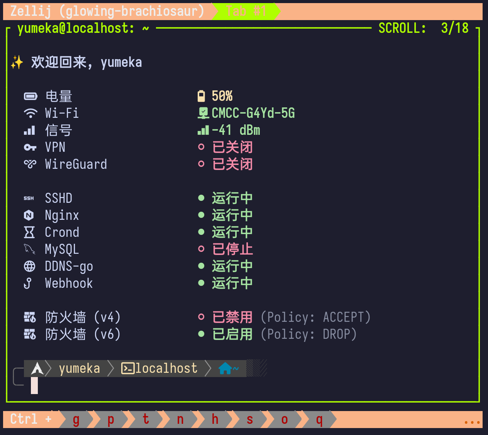

+++
date = '2025-11-01T16:14:51+08:00'
title = 'Hi There 👋'
+++

> 第一次搭服务器，第一次建网站！

你好～这里是 Yumeka，也可以叫我 梦花、夢花、夢梦...什么都可以的

这个服务器可能会因为各种原因非常不稳定，它运行在 **OnePlus PadPro** 的 **ArchLinuxARM (chroot)** 上，可能我把 Pad 带出去换一个网络，就无法访问了

其实完全可以用 vercel 之类的平台托管我的博客网站，但是我很菜的，什么都不会，所以想要借此机会学习一下服务器相关的知识

用 ssh 连接到平板，在 chroot 内通过挂载的 /proc/1/root 越狱，就可以远程开关手电筒、打开屏幕、安装 apk、甚至是格机...很酷的，对吧！

说起来 yumeka.blog 这个域名只花了一美元，第二年就要收 20 美元，到时候应该能取消续费吧，应该吧）

### 会在博客上分享什么呢

可能会分享一些奇思妙想，还是日常？...

